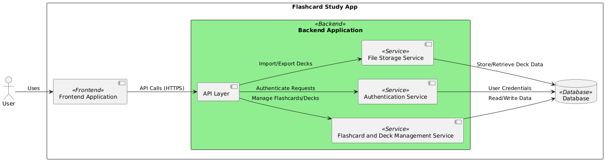

# Diagram Components and Interactions:
## Actors and Systems:
### User:
- The end-user interacts with the application via a web browser.
### Frontend Application (FrontendApp):
- The client-side application that provides the user interface.
- Technologies: React, Angular, or similar.
### Backend Application (BackendApp):
- Consists of several services handling different aspects of the application.
### Database (DB):
- Stores persistent data like user accounts, flashcards, decks, and progress tracking.
## Backend Services within BackendApp:
### API Layer (API):
- Entry point for all backend services.
- Exposes endpoints for the frontend to interact with.
### Authentication Service (AuthService):
- Manages user authentication and session management.
- Interacts with the database for verifying credentials.
### Flashcard and Deck Management Service (FlashcardService):
- Handles all operations related to flashcards and decks.
- Manages creation, editing, deletion, and retrieval of flashcards/decks.
### File Storage Service (FileService):
- Manages import and export functionality for decks.
- Processes file uploads/downloads and interacts with the database.
