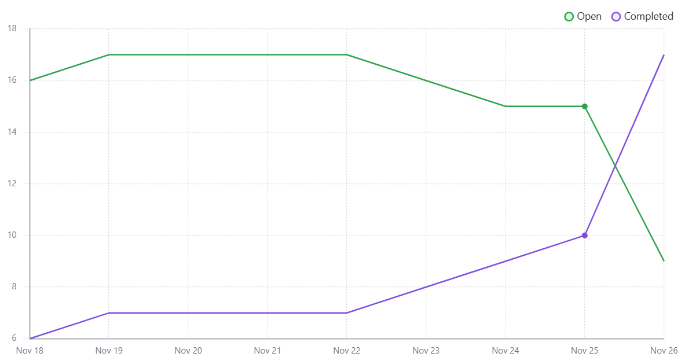

# Weekly Report

### Tasks this Cycle (With Contributors)
- **Dockerization**
  - **Karan** *(Primary)*
  - Milan
- **Postgres Database Setup**
  - **Milan** *(Primary)*
- **More Frontend Page Creation**
  - **Liam** *(Primary)*
- **Test Setup**
  - **Karan** *(Primary)*
  - Milan
- **Login Page (Frontend - Backend Connection)**
  - **Karan** *(Primary)*
- **Signup Page (Frontend - Backend Connection)**
  - **Milan** *(Primary)*
  - Karan
- **Page Protection**
  - **Karan** *(Primary)*
- **Navigation/Select Deck**
   - **Karan** *(Primary)*
  

#### Burndown Chart


---

## Summary
We’ve made excellent progress this week, with the project’s velocity significantly increasing after gaining a solid understanding of Dockerization and successfully setting up the database. While there was initially a steep learning curve for most developers, now that everyone is familiar with the language and project structure, we’ve been making remarkable strides in completing tasks from the Kanban board.


### Summary of Completed Tasks (With Pull Request Numbers)
#### Dockerization
- **Docker Compose File Setup**
- **Dockerfile Setup**

#### Database Setup
- **Postgres Database Declared in Docker Compose** (PR#35)
- **Added Initial Relational Schema** (PR#36)

#### More Frontend Page Creation
- **Added Back Button** (PR#34)
  - *(Liam to add more if missed)*

#### Test Setup
- **Utilizing Jest and Supertest** (PR#41)
- **Adding Dependencies to Project** (PR#41)

#### Login Page (Frontend - Backend Connection) (PR#44)
- **Created Backend Tests**
  - Test invalid login credentials
  - Test valid login credentials
- **Added Post for Login**
- **Added Handle Login Logic to Frontend Login Body Page**

#### Account Signup (PR#47)
- **Created Backend Tests**
  - Test new user with valid data
  - Test for missing fields
  - Test for catching errors
- **Created Frontend Tests for Validate Signup Method**
  - Test for error returned with empty fields
  - Test for error returned for missing length requirement
  - Test to return successful validation
- **Added Post for Insertion into Users Table**
- **Added Handle Signup Logic to Signup Page**

#### Protecting User Navigation (PR#50)
- **Frontend Tests for Protecting Routes**
  - Test to redirect user if user ID is not in local storage
  - Test to render the protected component if user ID exists
- **Secured Protected Pages**
  - Added logic for removing and adding user IDs to local storage

---

## Comments on the Process
Using a Dockerized React frontend with a Node.js backend and a PostgreSQL relational database has presented a steep learning curve for many of our developers. During the earlier milestones, this challenge made it difficult to complete tasks, as we were bottlenecked by the learning process and initial setup, causing delays in future development. However, by collaborating and developing a shared understanding of the project's scope and requirements, we have been able to recover much of the lost time and make significant progress, bringing us closer to the 60% completion target for Milestone 3.

---

### Tasks Completed (With Branch References)
- **Dockerization**  
  *(Branch Name: Development)*

- **Postgres Database Setup**  
  *(Branch Name: database-schema)*

- **More Frontend Page Creation**  
  *(Branch Name: CreateDeckPage)*

- **Test Setup**  
  *(Branch Name: signup_validity)*

- **Login Page Frontend - Backend Connection**  
  *(Branch Name: userLogin)*

- **Signup Page Frontend - Backend Connection**  
  *(Branch Name: User-Registration-Connection3, User-Registration-Connection2, User-Registration-Connection)*  
  - *Note: Significant learning was done in these branches; commits might be confusing.*

- **Page Protection**  
  *(Branch Name: userNavigation)*

---

## Release Candidate
- **Release is Pushed to Release-1**

### Steps for Construction on Your Machine
1. In the project directory, run:  
   ```bash
   docker compose --build
   ```
2. In backend and frontend directories, run:
   ```bash
   npm install
   ```
3. To run tests (in backend or frontend directory), run:
    ```bash
    npm test
    ```
4. Access the web project at: http://localhost:8080/
5. To view relational database updates (make SQL queries), run:
    ```bash
    docker exec -it the-project-drop-table-students-db-1 psql -U user -d mydb
    ```
---
## Testing Report
### Legend:
- **Status**:  
  - **P**: Pass  
  - **F**: Fail  

| Test Case ID | Feature       | Description                                                    | Status | Frontend | Backend |
|--------------|---------------|----------------------------------------------------------------|--------|----------|---------|
| TC01         | Signup        | A user should be able to create an account with valid details  | P      | ✅       | ✅      |
| TC02         | Signup        | Error message should appear when creating an account with missing fields | P      | ✅       |   NA    |
| TC03         | Signup        | Error message should appear when password is less than 6 characters | P      | ✅       |    NA   |
| TC04         | Flashcards    | User should be able to create a new flashcard                  | P      |  NA      | ✅      |
| TC05         | Flashcards    | User should be able to save a flashcard to the database        | P      |  NA      | ✅      |
