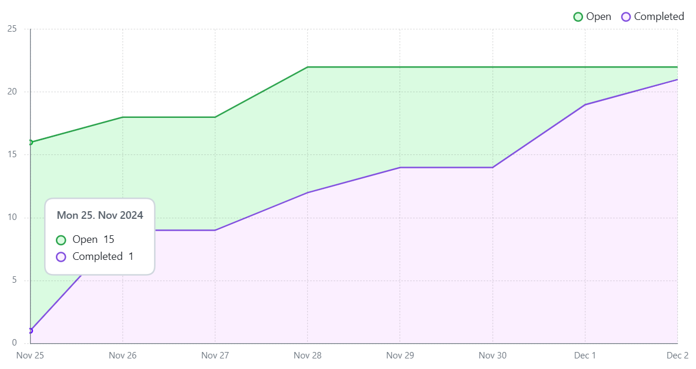

# Milestone 6

## Burndown Chart

## Tasks this Cycle (With Contributors)

### Loading Decks by User  
**PR#52**  
BranchName: `loadingDecks`

### Feature/Create Deck  
**PR#54**  
BranchName: `Create-Deck`

### Feature/Create Flashcard  
**PR#58, PR#64**  
BranchName: `createFlashcard-routes`  
BranchName: `hotfix/create-flashcard`

### Feature/Deck Deletion  
**PR#61**  
BranchName: `feature-deck-deletion`

### Feature/Deck Overview  
**PR#63**  
BranchName: `feature-deck-overview`

### Feature/Play Deck  
**PR#70**  
BranchName: `playDeck`

### Feature/Edit Flashcard  
**PR#71**  
BranchName: `feature/edit-flashcards`

### Feature/Share Flashcard  
**PR#72**  
BranchName: `ShareFlashcardFrontend`

### Bug Fixes  
**PR#73**  
BranchName: `bug-fixes`

### Feature/Edit Flashcard Delete  
**PR#75**  
BranchName: `feature/delete-button`

### Feature/Shuffled Cards  
**PR#76**  
BranchName: `feature/study-shufflemode`

---

## Summary

This week, the project has seen significant progress with the implementation of multiple new features and bug fixes. We’ve successfully added functionality to load decks by user, create and delete decks, and provide a detailed deck overview. Flashcard-specific features, including creation, editing, sharing, and a shuffle mode for studying, have also been integrated.  

Additionally, a play deck feature was implemented, and several critical bugs were resolved. Overall, the team has maintained a steady momentum, ensuring the project continues to evolve with robust functionality and user-centric improvements.

---

## Summary of Completed Tasks

### Loading Decks by User  
**PR#52**:  
- Add backend API to fetch user decks  
- Update frontend to display them  
- Improve UI design to be cleaner and more user-friendly  
- Basic tests for fetching decks:  
  - Test for valid user ID  
  - Test for invalid user ID  
  - Test if no decks are found  
  - Test for missing user ID  
  - Test for handling DB errors  

### Feature/Create Deck  
**PR#54**:  
- Functionality to create a new deck in the database  
- Tests for implementation of the feature:  
  - Test to create deck with valid data  
  - Test to create deck with missing fields  
  - Test for database error handling  
- Frontend connection  

### Feature/Create Flashcard  
**PR#58, PR#64**:  
- Functionality to the create flashcard button  
- Create flashcard routes to the database  
- Tests for implementation of the feature:  
  - Test to create a new flashcard with valid data  
  - Test if question or answer is missing  
  - Test if deck does not exist  

### Feature/Deck Deletion  
**PR#61**:  
- Functionality to delete a deck in the database  
- Tests for implementation of the feature:  
  - Test to delete with valid data  
  - Test to delete with invalid deck  
  - Test for deck not found  
- Frontend connection  

### Feature/Deck Overview  
**PR#63**:  
- Selecting a deck to take you to an overview of the specific deck  
- Tests for implementation of the feature:  
  - Retrieves correct details for valid deck  
  - Handles nonexistent decks with 404  
  - Validates missing `deck_id` error  
  - Simulates and handles database errors  

### Feature/Play Deck  
**PR#70**:  
- Backend test to fetch flashcards associated with a specific deck  
  - Tests if no flashcards are found  
  - Test for missing deck ID  
  - Test for handling errors  
- Endpoint to get the cards from each deck  
- Frontend functionality to display flashcards for a selected deck  

### Feature/Edit Flashcard  
**PR#71**:  
- New Edit Flashcard Page (with styling) to edit all flashcards at once  
- Created new API endpoint for updating flashcards to the database  
- Tests for API endpoint:  
  - Tests for no flashcards found  
  - Test for server error  

### Feature/Share Flashcard  
**PR#72**:  
- Replaced export deck button with share deck button  
- Implemented functionality so users can share their deck as public or with another user using username  
- Frontend tests for the logic:  
  - Test if no sharing option is selected  
  - Test sharing with a user and no username is provided  
  - Test sharing with a user and a username is provided  

### Bug Fixes  
**PR#73**:  
- Fixed how users retrieve decks, allowing access to shared decks  
- Resolved navigation issues within the application  
- Created a new endpoint to fetch user-specific decks  
- Implemented a test for the new endpoint to ensure functionality  

### Feature/Edit Flashcard Delete  
**PR#75**:  
- Adds delete button on edit flashcard page  
- Backend Endpoint  
- Tests for backend endpoint:  
  - Test to delete a flashcard successfully  

### Feature/Shuffled Cards  
**PR#76**:  
- Added button to shuffle or un-shuffle deck in the Play page  
- Removed study mode button on the Deck Page  

---

## Comments on the Process  

In this milestone, the team demonstrated a full grasp of the project requirements, system architecture, and development language, enabling us to catch up and complete over 95% of the project's functionality. This shared understanding not only accelerated development but also improved the PR review process, as everyone became more proficient in evaluating code quality and adhering to the established workflows. The combined technical fluency and streamlined collaboration have brought us closer than ever to project completion.

---

## Release Candidate  

**Release:** Pushed to `Release-2`

### Steps for construction onto your machine:  
1. In the project directory, run: `docker compose --build`  
2. Access the web project from: `http://localhost:8080/`  
3. To view relational database updates (make SQL queries):  
   - Run: `docker exec -it the-project-drop-table-students-db-1 psql -U user -d mydb`  

### For Testing  
1. In the backend directory, run: `npm install`  
2. In the frontend directory, run: `npm install`  
3. To run tests (in backend or frontend directory), run: `npm test`  

## Testing Plan 
# Test Overview

| **Subcategory**           | **Test Name**                                  | **Description**                                                                 | **Status**  |
|----------------------------|-----------------------------------------------|---------------------------------------------------------------------------------|-------------|
| **Backend API - Login**    | Should fail login with invalid credentials    | Verifies login fails for incorrect credentials.                                 | Passing     |
|                            | Should succeed with valid credentials         | Verifies login succeeds for correct credentials.                                | Passing     |
| **Backend API - Signup**   | Should create a new user with valid data      | Tests successful user creation with valid details.                              | Passing     |
|                            | Should return 400 for missing fields          | Ensures error is returned when required fields are missing.                     | Passing     |
|                            | Should handle database errors gracefully      | Checks proper error handling during database failures.                          | Passing     |
| **Load Decks API**         | Should return decks for a valid user ID       | Verifies retrieval of user decks with valid user ID.                            | Passing     |
|                            | Should return 404 if no decks are found       | Ensures appropriate response for non-existent decks.                            | Passing     |
|                            | Should return 400 for missing user ID         | Tests validation error when user ID is omitted.                                 | Passing     |
|                            | Should handle database errors gracefully      | Verifies error handling for database issues during deck retrieval.              | Passing     |
| **Create Deck API**        | Should create a new deck with valid data      | Confirms successful deck creation with proper input.                            | Passing     |
|                            | Should return 400 for missing fields          | Validates error for incomplete deck creation input.                             | Passing     |
|                            | Should handle database errors gracefully      | Ensures robust error handling for database failures during deck creation.       | Passing     |
| **Delete Deck API**        | Should delete the deck with valid deck ID     | Tests successful deletion of a deck using valid ID.                             | Passing     |
|                            | Should return 404 if deck does not exist      | Validates error response when the deck to delete is not found.                  | Passing     |
|                            | Should return 400 for missing or invalid ID   | Ensures error for invalid or missing deck ID.                                   | Passing     |
| **Flashcard API**          | Should create a new flashcard with valid data | Verifies creation of flashcard with correct data.                               | Passing     |
|                            | Should return 400 if question or answer is missing | Checks validation for incomplete flashcard data.                                | Passing     |
|                            | Should return 500 if deck does not exist      | Ensures appropriate error when trying to add flashcard to non-existent deck.    | Passing     |
|                            | Should update a flashcard successfully        | Verifies update operation for a flashcard.                                      | Passing     |
|                            | Should delete a flashcard successfully        | Confirms flashcard deletion functionality.                                      | Passing     |
|                            | Should return 404 if flashcard is not found   | Validates error for operations on a non-existent flashcard.                     | Passing     |
| **Sharing API**            | POST /api/share-deck-with-user - Missing params | Checks error handling for missing sharing parameters.                          | Passing     |
|                            | POST /api/make-deck-public - Missing deck ID  | Ensures validation error for missing deck ID during public sharing.             | Passing     |
| **Validation Functions**   | validateShareDeck - No sharing option selected | Tests error handling for missing sharing option input.                          | Passing     |
|                            | validateSignup - Missing fields               | Checks error for incomplete signup data.                                        | Passing     |
|                            | validateSignup - Password too short           | Ensures proper validation for short passwords.                                  | Passing     |

