# Sequence Diagrams

## 1. Create Deck
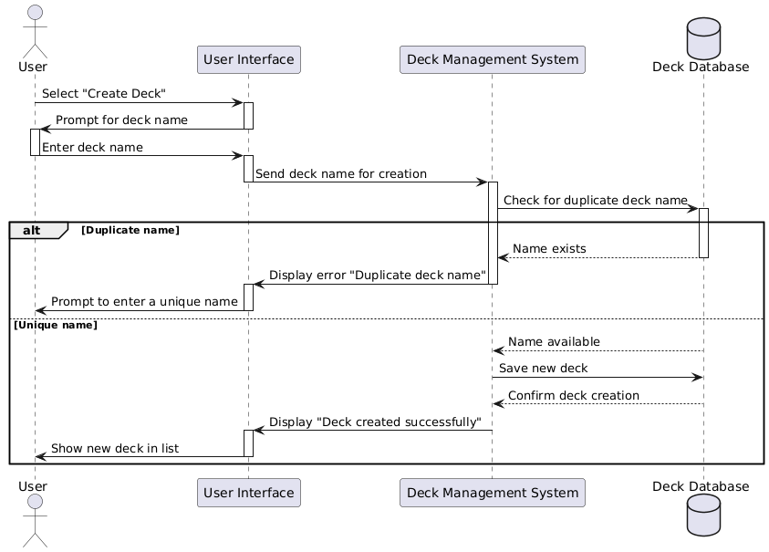
This diagram illustrates the process for creating a new deck. It includes steps where the user inputs the deck name, the system checks for duplicates, and the deck is saved if the name is unique.

## 2. Create Flashcard
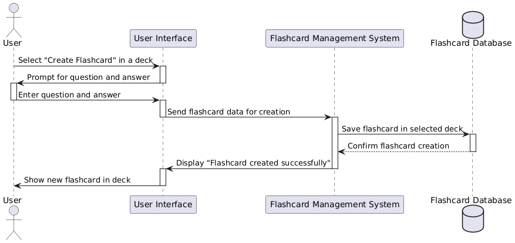
This diagram shows how a user creates a new flashcard within an existing deck. It involves entering the question and answer, and the system saving the flashcard in the selected deck.

## 3. Delete Deck
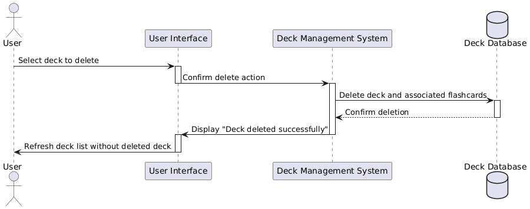
This diagram depicts the process of deleting a deck. The system prompts for confirmation, deletes the deck and its associated flashcards, and then refreshes the deck list.

## 4. Delete Flashcard
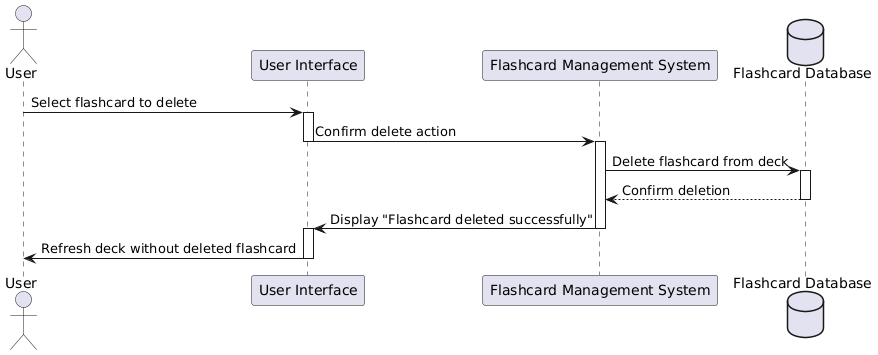
This diagram shows the sequence of actions for deleting a flashcard from within a deck. It includes a confirmation step, after which the flashcard is removed from the deck.

## 5. Export Deck
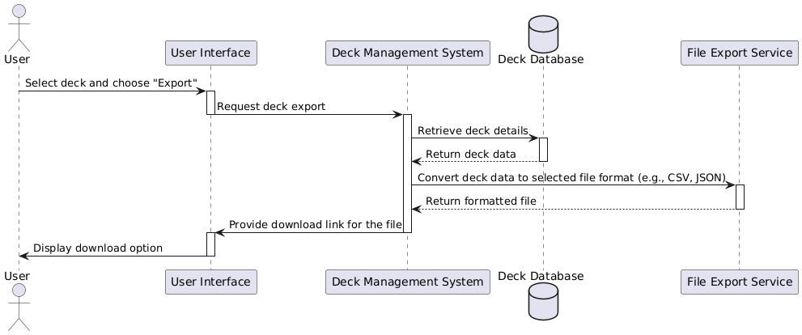
This diagram explains the export process, where a user can export a deck to a file format like CSV or JSON. The system retrieves the deck data, converts it, and provides a download link.

## 6. Import Deck
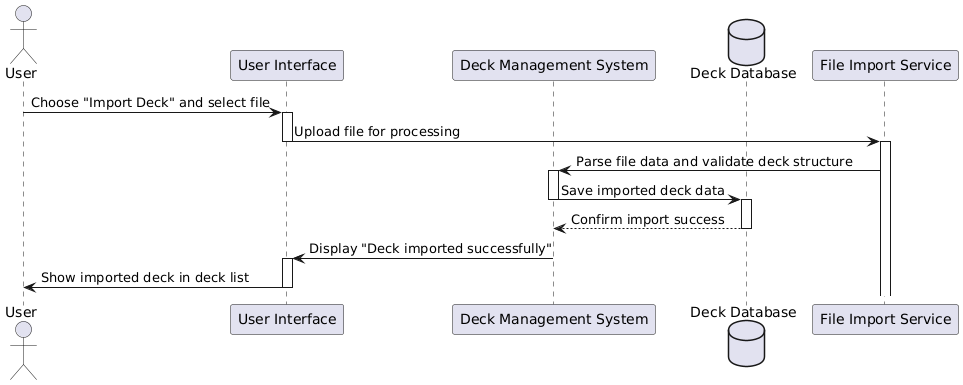
This diagram shows the import process for a deck. The user uploads a file, the system parses and validates it, and then saves the deck data, displaying it in the deck list.

## 7. Mark Flashcard as Known/Unknown
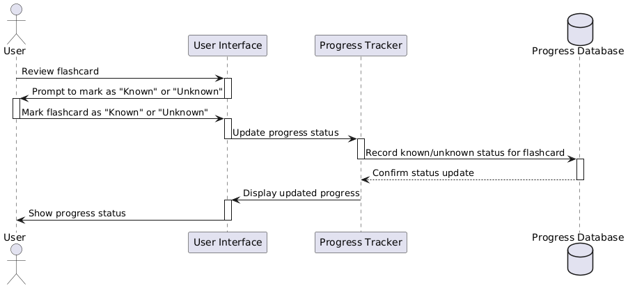
This diagram illustrates how a user can mark flashcards as "Known" or "Unknown" during a study session. The system records the status for tracking learning progress.

## 8. Login
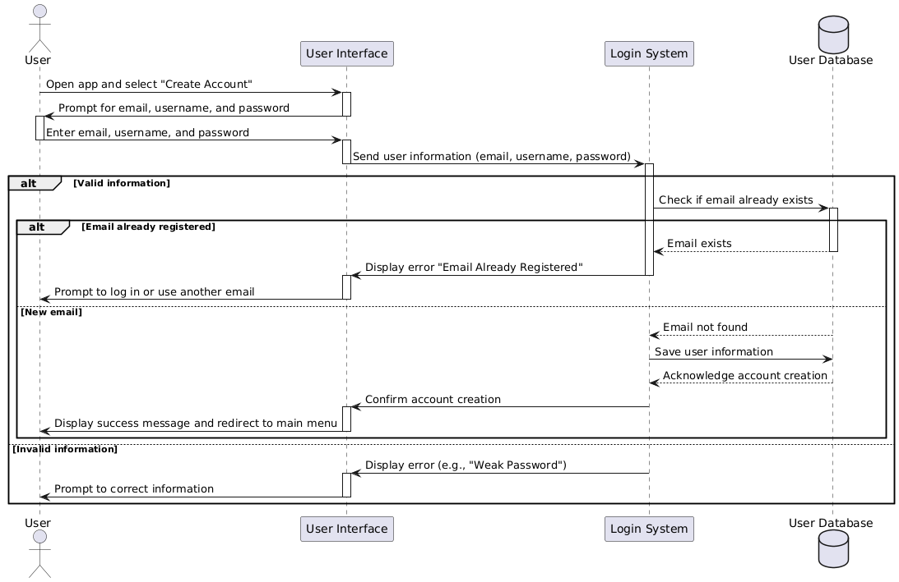
This diagram covers the login process, including user input of credentials, system authentication, and redirection to the main menu upon successful login.

## 9. Study Mode (Ordered)
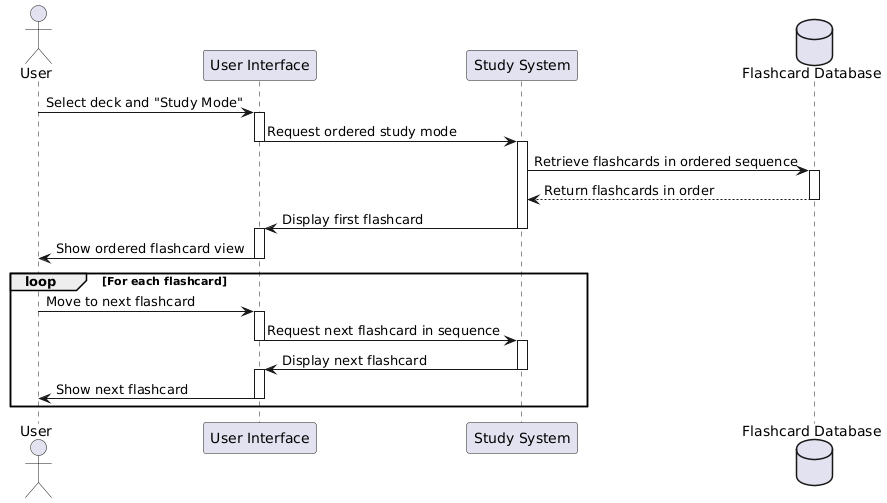
This diagram shows the ordered study mode, where flashcards are reviewed in a fixed sequence. The user navigates through flashcards one at a time in the specified order.

## 10. Study Mode (Randomized)
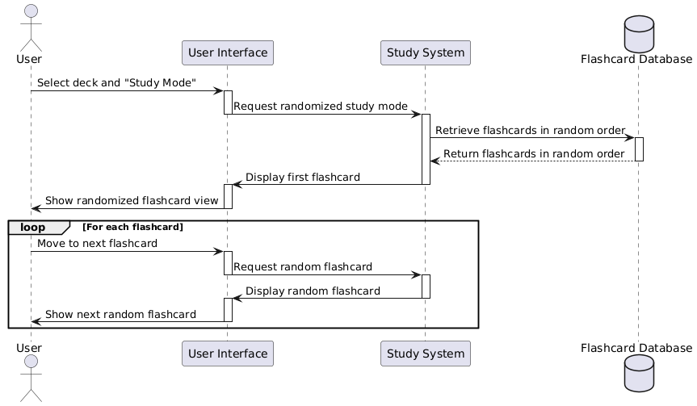
This diagram describes the randomized study mode. Flashcards are presented in a random order, with the user moving through them one by one.

## 11. Edit Deck
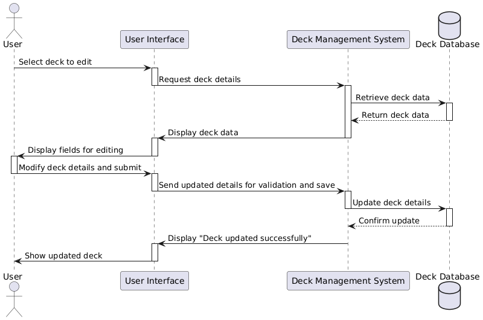
This diagram depicts the process for editing a deck’s details. The user selects the deck, modifies its information, and the system saves the updated details.

## 12. Edit Flashcard
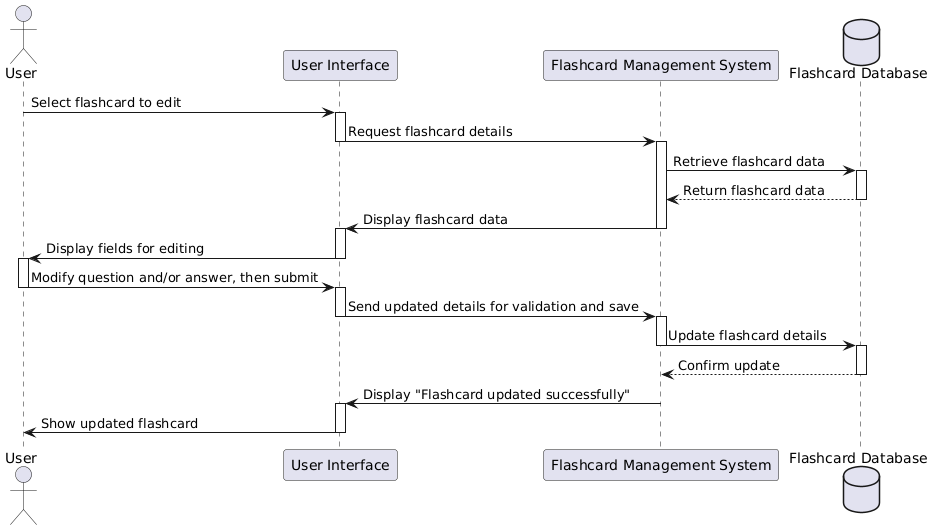
This diagram shows the sequence for editing an existing flashcard. The user updates the question or answer, and the system saves the changes to the flashcard in the deck.
